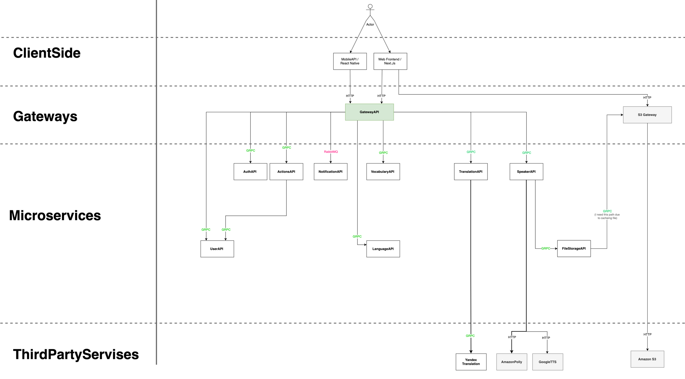

# GatewayAPI - For Example
I’ve placed one of my microservices in this repository to demonstrate my skills during my job search.

This is the Gateway for my pet project (wordbyword.io)

In this project, you can see how I've organized the architecture of my microservices and how I work with technologies like gRPC, RabbitMQ, and others.

It's worth noting that this is just the Gateway API. The full project architecture (high-level) looks something like this:

---
## P.S.
I understand that this is not the most perfect example, and I see areas for improvement, such as adding more metrics, unit tests, reworking the endpoints on the transport layer, improving logging, and so on.

However, I still consider it acceptable for demonstrating during an interview. I kindly ask not to be too critical and to keep in mind that if I didn’t manage to implement something in my pet project, it doesn’t mean I haven’t done it in real work projects (which I always approach with the utmost care, following all the most popular best practices 😉).

### Thank you so much for your time!
*Please contact me on LinkedIn or by email if you have any questions
